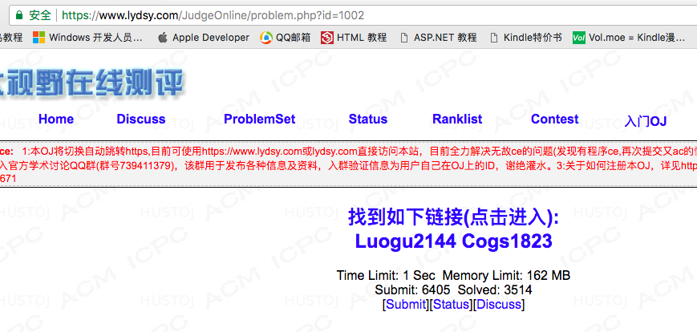
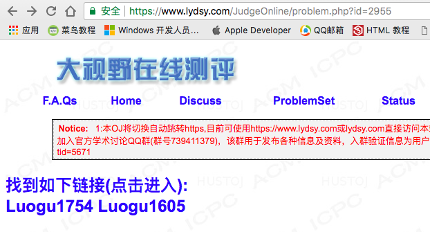

# BZBZ

**狗日的**BZOJ

本插件由[billchenchina](https://github.com/billchenchina)编写，是一个意图帮助 OIer 们在其他 OJ 上提交 BZOJ 权限题的插件。

本插件数据来源于[BZOJ 题号查找器](https://ruanx.pw/bzojch/bzojno.html)，感谢阮行止做出的贡献。

## 食用方法

1. 安装这个 Chrome 插件 (第三方插件安装方法清百度，或者通过源代码的形式安装)

2. 打开一个 BZOJ 的一道题

3. 跳转到其他优秀 OJ，开始刷题！

## 效果图

## TODO

* [x] 整合链接一步跳转

## 贡献者

[扩散性百万甜面包](https://github.com/Himself65)

## LICENCE

MIT
